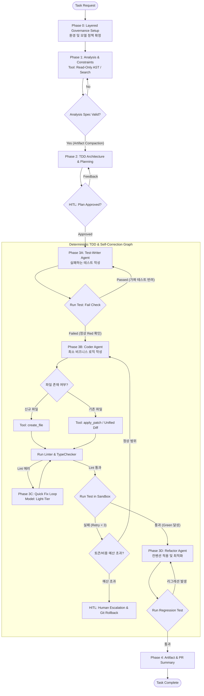

# State-Graph Agent Harness Engineering Pipeline (PoC v3.0)
> **Deterministic TDD Loop · Sandbox Isolation · Dynamic Governance & Context Compaction**

---

## 1. 개요 및 설계 철학 (Overview & Design Philosophy)

본 PoC는 특정 벤더 API나 에디터 툴에 종속되지 않는 **'상태 그래프(State-Graph) 기반의 AI 에이전트 하네스(Harness) 엔지니어링 파이프라인'**입니다. 

LLM의 비결정적 추론 한계를 극복하기 위해 **근거 우선 분석(Reasoning-First)**, **결정적 TDD 상태 머신**, **도구 권한 격리**, 그리고 **계층형 거버넌스(Interactive Initialization)**를 결합하여 안정적이고 재현 가능한 코드 개발 환경을 제공합니다.

### 1.1 핵심 가치 및 원칙
* **Reasoning Before Action:** 파일 수정/코드 작성 전 제약 조건 및 영향도 분석을 강제.
* **Deterministic TDD Anchor:** `Red(실패 검증) -> Green(최소 구현) -> Refactor(안전 개선)`를 그래프 엣지(Edge) 전이 조건으로 바인딩.
* **Least Privilege Tooling & Dynamic Routing:** 읽기 전용 페이즈와 쓰기 페이즈를 엄격히 분리하고, 신규 파일은 `create`, 기존 파일은 `patch`로 조건부 라우팅.
* **Context Compaction & Environment Isolation:** 대화 이력을 누적하지 않고 정형 산출물(Artifact)만 전달하며, Docker 샌드박스와 Git Worktree로 시스템 안전성 확보.
* **Interactive Layered Governance (HITL):** 초기 세팅 시 작업 환경과 모델/비용 통제 자유도를 계층형 인터랙션으로 확정.

---

## 2. 초기화 단계: 계층형 인터랙티브 거버넌스 (Layered Init Gate)

파이프라인 최초 기동 시 오케스트레이터는 사용자에게 2단계 계층형 질문을 던져 런타임 환경과 모델 제어 정책을 확정하고 `.agent/config.yaml`에 반영합니다.

```text
================================================================================
                    [Phase 0: Interactive Governance Setup]
================================================================================

[Step 1] 작업 런타임 환경 선택 (Runtime Environment)
  (1) Autonomous Pipeline Native (하네스/오케스트레이터가 전면 자동 제어)
  (2) IDE / Assistant Integration (IDE 화면 내 프롬프트 및 산출물 연동 모드)

[Step 2] 모델 라우팅 및 거버넌스 정책 선택 (Model & Cost Governance)
  (1) Full Auto Cascading [권장]
      - 분석/설계/테스트: 고성능 추론 모델 자동 배정
      - 린트 수정/단순 복구 루프: 고속·경량 모델 자동 스위칭 (비용 최적화)
  (2) Fixed High-Performance
      - 전 페이즈 고성능 모델 고정 운용
  (3) Custom Granular Control
      - 페이즈별(분석, TDD설계, 코딩, 린트, 리팩토링) 모델을 사용자가 직접 수동 매핑

================================================================================
```

### 2.1 통합 설정 명세 (`.agent/config.yaml`)
```yaml
runtime:
  mode: "pipeline_native"   # pipeline_native | ide_assisted
  sandbox: "docker"         # docker | local_isolated

governance:
  model_policy: "auto_cascading" # auto_cascading | fixed_high | custom
  budget:
    max_tokens_per_task: 80000
    max_cost_usd: 1.00
    max_retry_limit: 3

models:
  analysis: "high_tier"     # 예: Claude Sonnet / GPT-4o 계열
  tdd_design: "high_tier"
  coding: "high_tier"
  lint_fix: "light_tier"    # 예: Claude Haiku / GPT-4o-mini 계열
  refactor: "high_tier"
```

---

## 3. 상태 그래프 워크플로우 (State-Graph Architecture)

파이프라인의 모든 전이는 기계적 검증 도구(Linter, Test Runner)와 명시적 승인 게이트(HITL)에 의해서만 결정됩니다.



---

## 4. 페이즈별 하네스(Harness) 명세 및 격리 규칙

| 페이즈 | 배정 모델 Tier | 도구 권한 (Tool Whitelist) | 입력 컨텍스트 격리 | 완료/전이 조건 (Exit Gate) |
| :--- | :--- | :--- | :--- | :--- |
| **Phase 0: Setup** | Rule Engine | `config_loader`, `prompt_user` | 없음 | 런타임 환경 및 거버넌스 정책 확정 |
| **Phase 1: Analysis** | High-Tier | `read_file`, `list_dir`, `grep_search` (Read-Only) | 태스크 요구사항 + 프로젝트 전역 룰 | 기술 분석서(`analysis.md`) 생성 |
| **Phase 2: Planning** | High-Tier | 없음 (순수 추론 및 플랜 생성) | `analysis.md` + 아키텍처 규칙 | TDD 명세서(`plan.md`) 및 **HITL 사용자 승인** |
| **Phase 3A: Red Test** | High-Tier | `write_test_file`, `run_sandbox_test` | `plan.md` (단일 태스크 단위) | 테스트 실행 시 **반드시 실패(Assertion Error)** |
| **Phase 3B: Green Code** | High-Tier | `create_file` (신규), `apply_patch` (수정) | `plan.md` + 실패 테스트 + Traceback | 린트 통과 + 테스트 100% Pass |
| **Phase 3C: Lint Fix** | Light-Tier | `apply_patch`, `run_linter` | 린트 에러 로그 (국소 컨텍스트) | 린터/타입체커 0 Error, 0 Warning |
| **Phase 3D: Refactor** | High-Tier | `apply_patch`, `run_sandbox_test` | 소스 코드 + 프로젝트 스타일 컨벤션 | 기능 변경 없는 리팩토링 + 테스트 100% Pass 유지 |
| **Phase 4: Summary** | Light-Tier | `git_diff_summary`, `write_artifact` | Git Diff + 최종 테스트 결과 | 최종 PR 본문 작성 및 브랜치 머지 준비 |

---

## 5. 핵심 하네스 메커니즘 상세

### 5.1 파일 상태 기반 조건부 코드 도구 (`smart_code_writer`)
* **신규 파일 생성 (`create_file`):** 파일이 존재하지 않는 경우에만 전체 템플릿 코드 작성을 허용.
* **기존 파일 수정 (`apply_patch`):** 파일이 이미 존재할 경우 전체 덮어쓰기를 원천 차단하고, Git Unified Diff 형식의 최소 라인 패치만 허용하여 기존 코드 유실 및 토큰 낭비 방지.

### 5.2 결정적 샌드박스 및 Git 스냅샷 롤백
* **Docker 격리 환경:** 린트 및 테스트 실행은 호스트 OS가 아닌 일회용 Docker 컨테이너 내부에서 실행하여 사이드 이펙트 차단.
* **Git Worktree 롤백:** 자가 복구 루프가 3회 이상 실패하거나 토큰 예산이 초과될 경우, 임시 Worktree를 즉시 폐기(`git worktree remove --force`)하여 단 1초 만에 초기 정상 상태로 롤백.

### 5.3 컨텍스트 격리 및 상태 축약 (Context Compaction)
* 이전 페이즈의 대화 히스토리 전체를 넘기지 않고, 검증 완료된 **'정형 산출물(Artifact)'**만 다음 노드의 프롬프트로 주입하여 모델의 집중도 분산과 환각을 원천 차단.

---

## 6. 결론 및 기대 효과

1. **상태 기반 통제력 확보:** 복잡한 개발 작업을 TDD Red-Green-Refactor 그래프 노드로 쪼개어 AI의 예측 불가능한 행동을 완전히 억제.
2. **비용 효율성과 유연성 공존:** 초기 계층형 질문을 통해 프로젝트 성격에 따라 완전 자동 모델 스위칭 또는 사용자 맞춤 수동 제어를 자유롭게 선택.
3. **무결점 코드 생산:** 정적 분석(Linter), Fail-to-Pass 테스트 검증, Docker 격리 실행을 통해 프로덕션 수준의 신뢰성 확보.
